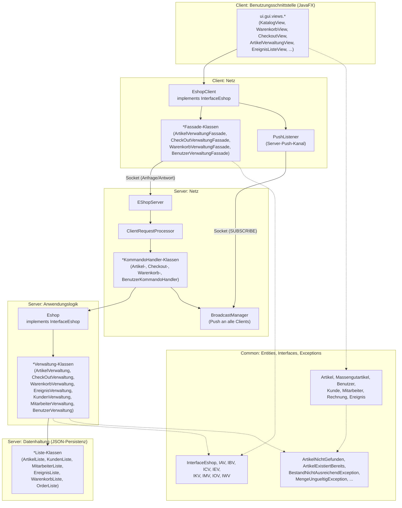

# Architektur / Klassendiagramm (vereinfacht)

Dieses Dokument gibt einen vereinfachten Überblick über die wichtigsten Klassen und ihre
Beziehungen, gruppiert nach der 3-Schichten-Architektur plus Netzwerk-Schicht (siehe
Übungsblätter 1–4). Für die vollständige Detailsicht siehe den von IntelliJ generierten
Klassendiagramm-Export im Projekt (*Diagram → Show Diagram* auf dem Projekt-Root).

## Übersicht der Schichten

## Kernklassen im Detail

### Common (`Common/src/main/java`)

- **Entities** (`entities.*`): `Artikel` (mit Unterklasse `Massengutartikel`, Vererbung),
  `Benutzer` (abstrakt, mit Unterklassen `Kunde` und `Mitarbeiter`), `Rechnung`, `Ereignis`.
  Diese Klassen werden unverändert von Client und Server benutzt und über Jackson als JSON
  über das Netzwerk verschickt (inkl. `@JsonTypeInfo`/`@JsonSubTypes` für Polymorphie).
- **Interfaces** (`interfaces.*`, `interfaces.moduls.*`): `InterfaceEshop` bündelt die
  moduls-Interfaces `IAV` (Artikel), `IBV` (Benutzer-Login), `ICV` (Checkout), `IEV`
  (Ereignisse), `IKV` (Kunden), `IMV` (Mitarbeiter), `IOV` (Bestellungen), `IWV` (Warenkorb).
  Sowohl `Eshop` (Server) als auch `EshopClient` implementieren `InterfaceEshop` — die GUI
  spricht daher immer gegen dieselbe Schnittstelle, unabhängig davon, ob sie lokal oder über
  das Netzwerk angesprochen wird.
- **Exceptions** (`exceptions.*`): fachliche Exceptions wie `ArtikelNichtGefunden`,
  `ArtikelExistiertBereits`, `BestandNichtAusreichendException`, `MengeUngueltigException`,
  `EmailBereitsVergebenException` usw. Werden in der Anwendungslogik geworfen, über das
  Netzwerkprotokoll als Name + Nachricht übertragen und auf Client-Seite wieder in die
  passende typisierte Exception umgewandelt (`ServerFehlerException` → konkrete Exception via
  `mitFertigerNachricht(...)`-Factory).

### Server (`Server/src/main/java`)

- **`logic.Eshop`**: zentrale Fassade der Anwendungslogik, komponiert alle `*Verwaltung`-
  Klassen und implementiert `InterfaceEshop`.
- **`logic.verwaltung.*`**: je eine Verwaltungsklasse pro fachlichem Bereich
  (`ArtikelVerwaltung`, `CheckOutVerwaltung`, `WarenkorbVerwaltung`, `EreignisVerwaltung`,
  `KundenVerwaltung`, `MitarbeiterVerwaltung`, `BenutzerVerwaltung`). Zugriffe auf gemeinsame
  Datenstrukturen sind `synchronized`, da mehrere Client-Threads gleichzeitig zugreifen können.
- **`persistence.shop.*` / `persistence.user.*`**: einfache Container-Klassen
  (`ArtikelListe`, `KundenListe`, `MitarbeiterListe`, `EreignisListe`, `WarenkorbListe`,
  `OrderListe`), die als JSON-Dateien persistiert werden.
- **`net.*`**: `EShopServer` (Verbindungsannahme, ein Thread pro Client),
  `ClientRequestProcessor` (Kommando-Dispatch), `*KommandoHandler` (Fachlogik pro
  Kommandogruppe), `BroadcastManager` (Server-Push an alle Clients).

### Client (`Client/src/main/java`)

- **`net.EshopClient`**: implementiert `InterfaceEshop` clientseitig, delegiert an die
  `*Fassade`-Klassen (analog zur `BibliotheksFassade` aus dem Vorlesungsbeispiel).
- **`net.*Fassade`**: eine Fassade je moduls-Interface, kapselt die Socket-Kommunikation für
  den jeweiligen fachlichen Bereich.
- **`net.PushListener`**: eigener Socket-Kanal, über den der Server unaufgefordert Änderungen
  meldet (siehe [Kommunikationsprotokoll.md](Kommunikationsprotokoll.md)).
- **`ui.gui.*`**: JavaFX-GUI (Views, Scenes, Components), abhängig von `session.SessionManager`
  für die aktuell eingeloggte Person.
- **`ui.cui.*`**: textbasierte Alternative zur GUI (aus Übungsblatt 1), für schnelle Tests des
  Anwendungskerns ohne JavaFX.

## Weiterführende Dokumentation

- [Kommunikationsprotokoll.md](Kommunikationsprotokoll.md) – Client/Server-Protokoll als
  endlicher Automat.
- [../README.md](../README.md) – Bauen und Starten des Projekts.
