# Kommunikationsprotokoll eShop (Server-Sicht)

Dieses Dokument beschreibt das Client/Server-Kommunikationsprotokoll aus Sicht des Servers
als endlichen Automaten (siehe Übungsblatt 4, Aufgabe 4). Es ergänzt den Code in
`Server/src/main/java/net/` (`EShopServer`, `ClientRequestProcessor`, `KommandoHandler`-
Unterklassen) und `Client/src/main/java/net/` (`ServerVerbindung`, `PushListener`,
`*Fassade`-Klassen).

## Grundidee

Der Server ist zeilenbasiert und textbasiert. Für jede eingehende Socket-Verbindung startet
`EShopServer` einen eigenen Thread, der einen eigenen, unabhängigen Automaten durchläuft (d.h.
mehrere Clients haben jeweils ihre eigene Instanz dieses Automaten - der Zustand wird **pro
Verbindung**, nicht global gehalten). Die eigentliche Zustandsverarbeitung teilt sich auf zwei
Klassen auf:

- `EShopServer.verbindungBehandeln(Socket)` entscheidet direkt nach dem Verbindungsaufbau,
  ob es sich um einen normalen Kommando-Kanal oder einen reinen **Push-Kanal** handelt
  (erste Zeile `SUBSCRIBE`).
- `ClientRequestProcessor` verarbeitet danach fortlaufend Kommandos auf dem Kommando-Kanal,
  bis der Client `QUIT` sendet oder die Verbindung abbricht.

## Zustandsdiagramm

```mermaid
stateDiagram-v2
    [*] --> Wartend: Server startet, ServerSocket.accept() in Schleife

    Wartend --> ErsteZeileLesen: Verbindung akzeptiert (neuer Thread pro Client)

    ErsteZeileLesen --> VerbindungBeendet: erste Zeile == null (Client hat sofort getrennt)

    ErsteZeileLesen --> PushKanalAktiv: erste Zeile == "SUBSCRIBE"
    ErsteZeileLesen --> WartetAufKommando: erste Zeile ist ein normales Kommando

    state PushKanalAktiv {
        [*] --> Registriert: BroadcastManager.registrieren(out)
        Registriert --> Registriert: liest weiter (blockiert bis Client trennt);\nempfaengt KEINE Anfragen, nur Broadcasts
    }
    PushKanalAktiv --> VerbindungBeendet: Client trennt / IOException\n(BroadcastManager.entfernen(out))

    state WartetAufKommando {
        [*] --> KommandoEmpfangen
        KommandoEmpfangen --> Verarbeitung: Kommando != "QUIT" und != null
        Verarbeitung --> AntwortSenden: passender KommandoHandler.verarbeite(...)\n(ArtikelKommandoHandler, CheckoutKommandoHandler,\nWarenkorbKommandoHandler, BenutzerKommandoHandler)
        AntwortSenden --> KommandoEmpfangen: OK[+Daten] oder ERROR[+Meldung]\ngesendet, naechste Zeile lesen
    }

    WartetAufKommando --> VerbindungBeendet: Kommando == "QUIT"\n(socket.close())
    WartetAufKommando --> VerbindungBeendet: readLine() == null / IOException\n(Client hat Verbindung verloren)

    VerbindungBeendet --> [*]
```

## Zustände im Detail

| Zustand | Beschreibung |
|---|---|
| **Wartend** | Server-Hauptschleife in `EShopServer.starten()`, blockiert in `serverSocket.accept()`. |
| **ErsteZeileLesen** | Direkt nach Verbindungsaufbau liest der Server die erste Zeile, um zwischen Push-Kanal und Kommando-Kanal zu unterscheiden. |
| **PushKanalAktiv** | Reiner Empfangs-Kanal für den Client: der Server trägt den `PrintWriter` in den `BroadcastManager` ein und sendet fortan bei jeder relevanten Server-Änderung (z.B. Bestandsänderung) unaufgefordert `ARTIKEL_GEAENDERT`. Dieser Kanal nimmt selbst keine Kommandos entgegen. Wird von `PushListener` auf Client-Seite geöffnet, siehe „Zusatzpunkte" unten. |
| **WartetAufKommando / KommandoEmpfangen** | Normaler Anfrage/Antwort-Betrieb: Server liest eine Kommandozeile (z.B. `ARTIKEL_ANLEGEN`). |
| **Verarbeitung** | Das Kommando wird an den zuständigen `KommandoHandler` delegiert (`istZustaendig(...)` prüft Zuständigkeit), der ggf. weitere Parameterzeilen liest und die Anwendungslogik (`Eshop`) aufruft. |
| **AntwortSenden** | Handler schreibt `OK` (+ optionale JSON-Nutzdaten in der Folgezeile) oder `ERROR` (+ Exception-Name und Meldung) zurück, danach zurück in den Wartezustand. |
| **VerbindungBeendet** | Terminalzustand: Socket wird geschlossen, Thread endet. Erreicht durch `QUIT`, EOF/`null` beim Lesen, oder `IOException`. |

## Kommandos je Handler (Übergänge in „Verarbeitung")

**ArtikelKommandoHandler** (Artikel-/Lagerverwaltung, IAV):
`ARTIKEL_ANLEGEN`, `MASSENGUT_ANLEGEN`, `BESTAND_ERHOEHEN`, `BESTAND_REDUZIEREN`,
`ARTIKEL_LOESCHEN`, `BESTANDSHISTORIE`, `ALLE_ARTIKEL`, `ARTIKEL_FINDEN`, `ALLE_EREIGNISSE`

**CheckoutKommandoHandler** (Kauf/Bestellungen, ICV):
`CHECKOUT`, `NETTOSUMME`, `BESTELLVERLAUF`

**WarenkorbKommandoHandler** (Warenkorb, IWV):
`WARENKORB_HINZUFUEGEN`, `WARENKORB_ENTFERNEN`, `WARENKORB_MENGE_AENDERN`, `WARENKORB_LEEREN`,
`WARENKORB_ANZEIGEN`

**BenutzerKommandoHandler** (Login/Registrierung, IBV/IKV/IMV):
`BENUTZER_CHECK`, `PASSWORD_CHECK`, `EMAIL_VERGEBEN`, `KUNDE_REGISTRIEREN`,
`MITARBEITER_ANLEGEN`, `GET_KUNDE`, `GET_MITARBEITER`, `GET_ALLE_KUNDEN`, `GET_ALLE_MITARBEITER`

Jedes dieser Kommandos durchläuft aus Automaten-Sicht denselben Zyklus
`KommandoEmpfangen -> Verarbeitung -> AntwortSenden -> KommandoEmpfangen`; sie unterscheiden
sich nur darin, wie viele Parameterzeilen der jeweilige Handler zusätzlich liest und welche
JSON-Struktur die Antwort hat.

## Zusatzpunkte-Feature: Server-Push

Für die automatische Aktualisierung aller Clients (siehe Zusatzpunkte-Absatz auf Blatt 4)
öffnet jeder Client zusätzlich zur normalen Kommando-Verbindung eine **zweite** Socket-
Verbindung, auf der er sofort `SUBSCRIBE` sendet und danach nur noch liest (`PushListener`
auf Client-Seite). Diese zweite Verbindung landet im Automaten sofort im Zustand
`PushKanalAktiv` und bleibt dort für die gesamte Sitzung. Ändert ein beliebiger anderer Client
über seinen Kommando-Kanal den Bestand (Kauf, Ein-/Auslagerung), broadcastet der jeweilige
`KommandoHandler` `ARTIKEL_GEAENDERT` über den `BroadcastManager` an alle registrierten
Push-Kanäle; die GUIs der anderen Clients laden daraufhin automatisch neu, ohne dass ein
Refresh-Button gedrückt werden muss.

Diese Trennung in zwei Kanäle wurde bewusst gewählt: der Push-Kanal ist rein asynchron
(Server -> Client, keine Anfragen), während der Kommando-Kanal streng synchron nach dem
Anfrage/Antwort-Schema arbeitet. Eine Vermischung beider Kommunikationsarten auf derselben
Verbindung hätte das bestehende zeilenbasierte Parsing verkompliziert und fehleranfälliger
gemacht.
